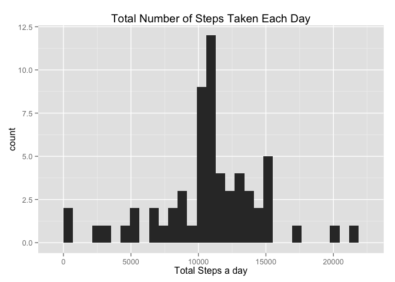
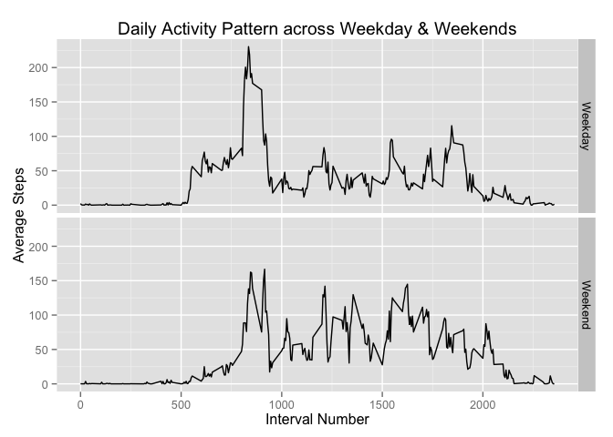
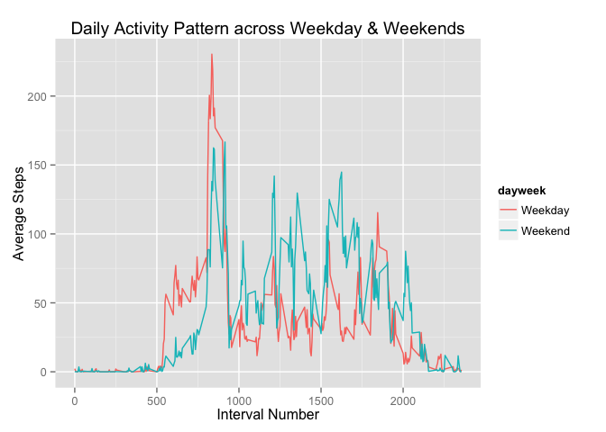

# Reproducible Research: Peer Assessment 1

## Loading and preprocessing the data

1. We start by loading some libraries we will require as well as read the data:


```r
# Loading libraries
library(dplyr)
```

```
## 
## Attaching package: 'dplyr'
## 
## The following objects are masked from 'package:stats':
## 
##     filter, lag
## 
## The following objects are masked from 'package:base':
## 
##     intersect, setdiff, setequal, union
```

```r
library(ggplot2)
library(lattice)
# Reading data
data <- read.csv("activity.csv")
```

2. We then start processing these data


```r
# Setting the date format
data$date <- as.Date(data$date, format = "%Y-%m-%d")
# Working out total number of steps per day
totsteps <- group_by(data, date)
totsteps <- summarize(totsteps, sum(steps, na.rm = TRUE))
names(totsteps) <- c("date", "totalsteps")
# Summarizing by Intervals
avgint <- group_by(data, interval)
avgint <- summarize(avgint, mean(steps, na.rm = TRUE))
names(avgint) <- c("interval", "avgsteps")
```


## What is mean total number of steps taken per day?

1. We first want to generate a histogram of the total number of steps taken each day to look at the distribution of total steps


```r
qplot(totsteps$totalsteps, data = totsteps, xlab = "Total Steps a day", main = "Total Number of Steps Taken Each Day", geom = "histogram")
```

```
## stat_bin: binwidth defaulted to range/30. Use 'binwidth = x' to adjust this.
```

 

2. We then calculate the mean and median from the data using the following codes and save them in variables which we will use to show the results subsequently.


```r
totstepmean <- round(mean(totsteps$totalsteps, na.rm = TRUE), digits = 2)
totstepmed <- median(totsteps$totalsteps, na.rm = TRUE)
```

The **Mean** total number of steps each day is **9354.23** and the **Median** total number of steps each day is **10395**.


## What is the average daily activity pattern?


```r
qplot(avgint$interval, avgint$avgsteps, data = avgint, ylab = "Average Steps", xlab = "Interval Number", main = "Daily Activity Pattern", geom = "line")
```

 

```r
maxsteps <- avgint[which(avgint$avgsteps==max(avgint$avgsteps)),]
```

As we can see from the output, the 5-minute interval with the maximum number is steps is interval = 835.

## Imputing missing values

1. To report the number of missing days, we run the following:


```r
sum(is.na(data$steps))
```

```
## [1] 2304
```

2. We need to impute figures for these NAs. Let us simply use the mean for that particular interval across the days. So we implement that first by creating a vector 'navec' that will be TRUE when there is an 'NA' in the particular entry of the 'steps' in the database. We then create a vector 'impvec' that fills those TRUE entries with the average steps in that particular interval across the days but fills FALSE with zero.


```r
navec <- is.na(data$steps)
impvec <- navec * avgint$avgsteps
```

3. The second data set is created with NAs replaced with zeroes and then we add the 'impvec' entry by entry to this new data set, 'data2'


```r
data2 <- data
data2$steps[is.na(data2$steps)] <- 0
data2$steps <- impvec + data2$steps
```

4. Now we want to investigate the impacts of imputation on the distribution of the total steps. We do this by simply applying the same data processing to this new dataset and then plot the distribution:


```r
totsteps2 <- group_by(data2, date)
totsteps2 <- summarize(totsteps2, sum(steps, na.rm = TRUE))
names(totsteps2) <- c("date", "totalsteps")
# Plot the histogram
qplot(totsteps2$totalsteps, data = totsteps2, main = "Total Number of Steps Taken Each Day", xlab = "Total Steps a day", geom = "histogram")
```

```
## stat_bin: binwidth defaulted to range/30. Use 'binwidth = x' to adjust this.
```

 

We then calculate and report the mean and median again as with above


```r
totstepmean2 <- round(mean(totsteps2$totalsteps, na.rm = TRUE), digits = 2)
totstepmed2 <- median(totsteps2$totalsteps, na.rm = TRUE)
```

The **Mean** total number of steps each day is **1.0766 &times; 10<sup>4</sup>** and the **Median** total number of steps each day is **1.0766 &times; 10<sup>4</sup>**. This is changed from the previous result; primarily because the new imputed value drives up the number of days where total steps are closer to the average. And then the median likewise converges towards the middle, making it closer to the mean in this new dataset.


## Are there differences in activity patterns between weekdays and weekends?

1. We first create a variable in the new dataset that gives an indication of the day of the week for that particular date. Then we create the new factor variable that will have 2 levels ('weekdays' and 'weekends'):


```r
data2 <- mutate(data2, dayweek = weekdays(date))
data2$dayweek <- as.factor(data2$dayweek)
# Replacing Saturday and Sunday as Weekend
data2$dayweek <- gsub("Saturday", "Weekend", data2$dayweek)
data2$dayweek <- gsub("Sunday", "Weekend", data2$dayweek)
# Replacing all other days as Weekday
data2$dayweek[which(data2$dayweek != "Weekend")] <- "Weekday"
data2$dayweek <- as.factor(data2$dayweek)
```

2. To plot the require graph, we have to take the average across the intervals to form the dataset that is used for creating the panel plots required.


```r
data2 <- group_by(data2, interval, dayweek)
avgday <- summarize(data2, mean(steps))
names(avgday) = c("interval", "dayweek", "avgsteps")
qplot(interval, avgsteps, data = avgday, facets = dayweek ~ ., ylab = "Average Steps", xlab = "Interval Number", main = "Daily Activity Pattern across Weekday & Weekends", geom = "line")
```

 

To compare across weekday and weekends more directly, we can plot the data on the same axes.


```r
qplot(interval, avgsteps, data = avgday, colour = dayweek, ylab = "Average Steps", xlab = "Interval Number", main = "Daily Activity Pattern across Weekday & Weekends", geom = "line")
```

 

We see that between intervals 500 and 1000, there is usually higher average steps on weekdays than weekends but for the rest of the day, average steps across weekends are higher than weekdays.
