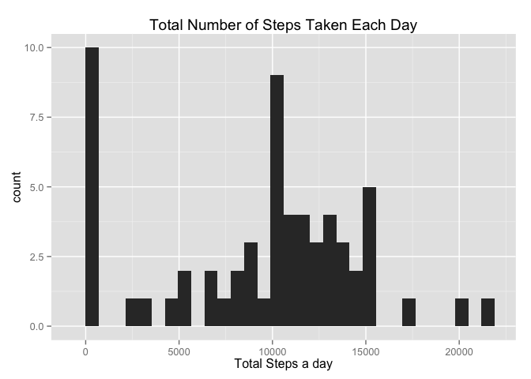

# Reproducible Research: Peer Assessment 1

## Loading and preprocessing the data


```r
# Loading libraries
library(dplyr)
```

```
## 
## Attaching package: 'dplyr'
## 
## The following objects are masked from 'package:stats':
## 
##     filter, lag
## 
## The following objects are masked from 'package:base':
## 
##     intersect, setdiff, setequal, union
```

```r
library(ggplot2)
# Reading data
data <- read.csv("activity.csv")
# Setting the date format
data$date <- as.Date(data$date, format = "%Y-%m-%d")
# Working out total number of steps per day
totsteps <- group_by(data, date)
totsteps <- summarize(totsteps, sum(steps))
names(totsteps) <- c("date", "totalsteps")
# Summarizing by Intervals
avgint <- group_by(data, interval)
avgint <- summarize(avgint, mean(steps, na.rm = TRUE))
names(avgint) <- c("interval", "avgsteps")
```


## What is mean total number of steps taken per day?


```r
qplot(totsteps$totalsteps, data = totsteps, main = "Total Number of Steps Taken Each Day", geom = "histogram")
```

```
## stat_bin: binwidth defaulted to range/30. Use 'binwidth = x' to adjust this.
```

 

```r
totstepmean <- round(mean(totsteps$totalsteps, na.rm = TRUE), digits = 2)
totstepmed <- median(totsteps$totalsteps, na.rm = TRUE)
```


The **Mean** total number of steps each day is **1.0766 &times; 10<sup>4</sup>** and the **Median** total number of steps each day is **10765**.


## What is the average daily activity pattern?


```r
qplot(avgint$interval, avgint$avgsteps, data = avgint, main = "Daily Activity Pattern", geom = "line")
```

 

```r
maxsteps <- avgint[which(avgint$avgsteps==max(avgint$avgsteps)),]
```

As we can see from the output, the 5-minute interval with the maximum number is steps is 835

## Imputing missing values


## Are there differences in activity patterns between weekdays and weekends?
